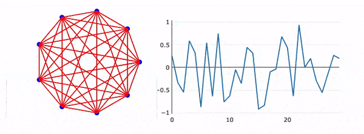

# Graphics Parser based on D3.js
*written with love in Javascript*



***Early Development Stage!***

__This is a core component of [Wolfram JS Frontend](https://github.com/JerryI/wolfram-js-frontend) project__
but one can try to use it independently as well

## Features
There are a lot of functions, which are not implemented such as `Style[]`, many primitives and etc. However the minimal set for the functioning of `Plot`, line and point primitives is already done.


### Graphics support
Native Mathematica's plotting functions in the ends generate `Graphics` expressing with a recipy to cook the desired plot using primitives `Line`, `Point` and etc. Curnetly, the following primitives are supported relying on D3 library API

- `Point`
- `Line`

with optional styling

- `AbsoluteThickness`
- `PointSize`
- `Opacity`
- `RGBColor`
- `Hue`
- `Epilog`
- `Prolog`

For example the gif animation from the title can be recreated using the standart example from Mathematica
```mathematica
pts = Table[{Cos[2 n Pi/9], Sin[2 n Pi/9]}, {n, 0, 8}] // N;
Graphics[{Opacity[0.7], Red, Line[Tuples[pts, 2]], Blue, PointSize[0.05], Point[pts]}]
```
no modifications are needed.

## Dynamic update
Each primitive itself supports `update` method if it contains a frontend object inside (see [WLJS](https://github.com/JerryI/wljs-interpreter)). However if you want to animate a line plot or many data points at ease - use the following

### `EventHandler`
This mimics the original function from Mathematica. You can use it as a wrapper for any primitive used in `Graphics`. There are a few event listeners are supported by now

- `"drag"` provides a pair of coordinates for dragged object
- `"zoom"` provides one number from 0 to inf stands for the relative zoom (wheel movement)

Here is an example of how one can use it

```mathematica
Graphics[{
  Red, PointSize[0.1], 
  EventHandler[
    Point[{0.5,0.5}]
  , {
     "drag"->Function[c, Print[c]],
     "zoom"->Function[k, Print[k]]
    }]
}, PlotRange->{{-1,1},{0,1}},Axes->True]
```

when you drag or zoom+drag a red point, kernel will print all events using the provided functions.

#### 🎡 Example with Gaussian curve
Let us try to do something much more interesting - interactive curve fitting, that involves `update` methods, `FrontEndExecutable` and etc.

Firstly, we need to define the curve
```mathematica
initial = {0, 1, 0.1};

getGauss[x0_, A_, width_] := (
  initial = {x0, A, width};
  Table[{x, A Power[E, -(x-x0)^2 / (2 width^2)]}, {x,-1,1,0.01}] // Quiet
);
(* an alias *)
getGauss[{x0_, A_}, width_] := getGauss[x0, A, width];
```

By calling `getGauss` we sample the curve into a table of points. Next we need a sharable object, that will provide the curve to the frontend

```mathematica
CreateFrontEndObject[getGauss@@initial, "point"]
```

And the last step - our plotting function

```mathematica
Graphics[{
  Red, PointSize[0.1], 

  EventHandler[
    Point[initial[[1;;2]]]
  , {
    "drag"->Function[c, FrontEndRef["point"]= getGauss[c, initial//Last]],
    "zoom"->Function[k, FrontEndRef["point"]= getGauss[initial[[1;;2]], k/10]]
    }],
  
  Cyan, Line[FrontEndRef[FrontEndRef["point"]]]
}, PlotRange->{{-1,1},{0,1}}, "TransitionDuration"->0, Axes->{True, False}]
```

Each time you drag a point, it will update the shared variable `point` with a new curve. 


No redrawing or reevaluation of a cell happends, it relies on a `update` methods of each primitive and update only the changed part.

If you want to learn more on how to efficiently update the data - please see [Here must be a link to DOCS, but may be it is too early.](/sorry)

## Development
🚧 to be written

## License

Project is released under the GNU General Public License (GPL).
