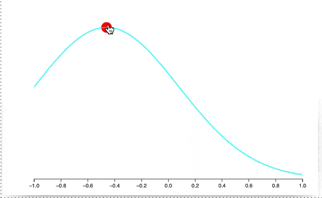

# 2D Graphics engine for Wolfram Language based on D3.js
*written with love in Javascript*

__This is a core component of [Wolfram JS Frontend](https://github.com/JerryI/wolfram-js-frontend) project__
but one can try to use it independently as well [SEE HOW](https://jerryi.github.io/wlx-docs/)

Please see docs here [DOCS](https://jerryi.github.io/wljs-docs/frontend/Reference/Graphics/)

No redrawing or reevaluation of a cell happends, it relies on a `update` methods of each primitive and update only the changed part.

## License

Project is released under the GNU General Public License (GPL).
